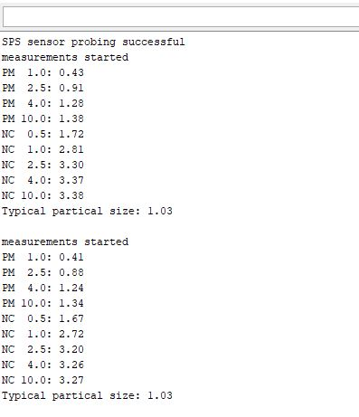
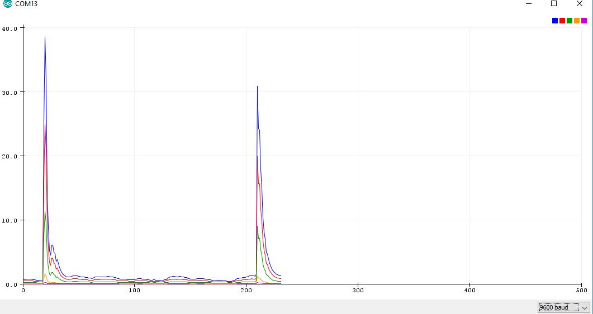

# Arduino library for the SPS30 particulate matter sensor

To learn more about the SPS30, please visit https://www.sensirion.com/sps30/. For support questions on the SPS30, please visit https://sensirion.com/contact.

This library is using the code from Sensirion's [embedded-sps](https://github.com/Sensirion/embedded-sps) library, and adding a handful of changes to adapt to Arduino.

Most notably, this is using an alternative [I2C Master Library](https://github.com/DSSCircuits/I2C-Master-Library) to work around the I2C buffer size limit that exists on certain Arduino platform, including the Arduino Uno series.

# Usage

## Serial Monitor (Text output)

1. Open the example from ```File > Examples > arduino-sps > sps30```. 
1. Open the serial monitor from the Tools menu
1. Press the "Upload" button to compile and upload the sketch

If you check the serial monitor window, you should see something like this:



## Serial Plotter (Graphical output)

1. Open the example from ```File > Examples > arduino-sps > sps30```. 
1. Open the serial plotter from the Tools menu (if you have the serial monitor open, you'll need to close it first)
1. Uncomment line 8 of the sample program; it should now read ```#define PLOTTER_FORMAT```
1. Press the "Upload" button to compile and upload the sketch

If you check the serial plotter window, you should see something like this:



